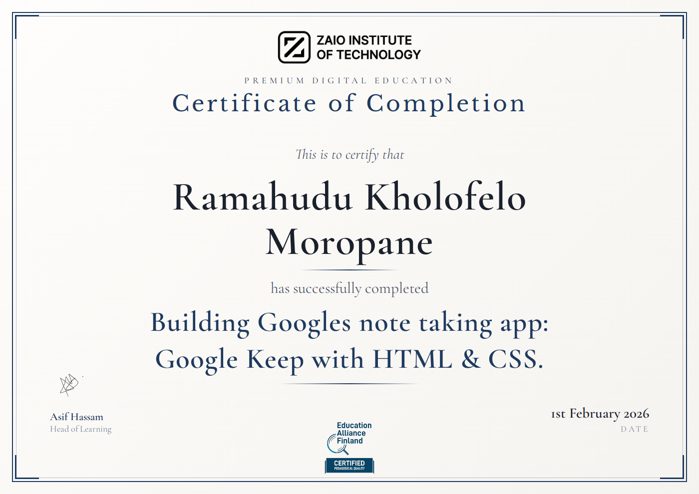

# Building Googles note taking app: Google Keep with HTML & CSS.

## About this project:
In this project I will set up my HTML & CSS-only app. I am cloning the Google's note taking app: Google Keep.

 ___

## Prerequisites
HTML, CSS, Introduction to JavaScript, Introduction to Object-Oriented Programming.
 ___

## Position property:
When using `position: absolute;`, you can use the `top`, `bottom`, `right`, and `left` properties to control the exact position of the element.

## Questions and answers:

- **What is the correct way to link an external CSS file to an HTML document?**
 > `<link href="styles.css" rel="stylesheet" type="text/css">`

- **What is the purpose of using a CSS file in web development?**
 > To define the styling and presentation of a web page

- **In VSCode, which extension allows you to launch a Live Server for your HTML files?**
 > Live Server

- **In CSS, what property is used to horizontally align flex items within a flex container with equal space between them?**
 > `justify-content: space-between;`

- **Which CSS property is applied to a flex container to activate the flexbox layout mode?**
> display: flex;

- **What's the main purpose of using flexbox in CSS?** 
 > Building flexible and responsive layouts

- **What are Google Icons?**
 > A set of scalable vector icons created by Google

- **In web development, why are icon libraries like Google Icons popular?**
 > They provide a consistent and easily customizable set of icons

- **What is the advantage of using an icon font like Google Icons?**
 > It reduces HTTP requests

- **What is the primary purpose of using padding in CSS?**
 > To add space between the border and the content inside an element

- **In CSS, which property controls the thickness, style, and color of the bottom border of an element?**
 > border-bottom

- **If you want to add 10 pixels of padding to all sides of a <`div>` element, which CSS rule should you use?**
 > `padding: 10px;`

- **In CSS, what property is commonly used to remove the default outline of an `<input>` element when it is focused?**
 > `outline: none;`

- **What is the purpose of the border-radius property in CSS?**
 > To round the corners of an element

- **Which CSS property is used to set the space between the content and the border of an element?**
 > padding

- **What is the primary purpose of the :hover class in CSS?**
 > To style an element when it is hovered over with the mouse pointer

- **Which CSS selector is used to apply styles to an element when the mouse pointer hovers over it?**
 > :hover

- **Which of the following properties can be modified using the :hover pseudo-class?**
 > Background color

- **Which CSS property can you use in conjunction with position: absolute; to precisely control the position of an element?**
 > top, right, bottom, and left

- **What does the opacity property in CSS control?*8
 > The transparency of an element

- **When you set opacity: 0; for an element, what happens to the element?**
 > It becomes fully transparent and invisible

- **What does the CSS property overflow-x: hidden do?**
 > It hides the horizontal scrollbar of an element

- **How does the CSS property flex-direction: column affect the layout of flexbox items?**
 > It arranges flex items in a vertical column

- **What does the nth-child selector do in CSS?**
 > It selects specific child elements based on their position in the parent

- **What does the box-shadow property in CSS control?**
 > Adding a drop shadow to an element's box

- **Which CSS property is used to limit the maximum width of an element?**
 > max-width

- **What does the CSS property `justify-content: space-between` do?**
 > Distributes space evenly between elements, pushing them to the edges of the container

- **What does the CSS property position: fixed do?**
 > Fixes the position of an element relative to the viewport

- **Which CSS property can be used in combination with position: fixed to specify the exact location of a fixed element on the viewport?**
 > top

- **When should you use position: fixed in CSS?**
 > To create elements that remain visible as you scroll

- **What does the CSS property display: flex do?**
 > Creates a flexible container for its child elements

- **Which axis does the flex-direction property control in a flex container?**
 > Main axis

- **How do you horizontally center flex items within a flex container?**
 > Set justify-content: center; on the flex container

- **What does the CSS property justify-content: space-between; do?**
 > Distributes space evenly between child elements along the main axis

- **Which of the following values for flex-direction arranges flex items vertically from top to bottom?**
 > column

- **How can you select all `
` elements that are descendants of a `
` element using CSS?**
 > div p

- **What does the CSS margin property "15px 0 0 10px" specify for an element?**
 > 15 pixels of margin on the top side, 0 pixels on the right and bottom sides, and 10 pixels on the left side

- **What does the CSS border property define?**
 > The area outside the content of an element

- **When should you use a `` element in HTML?**
> To group and style inline elements within a block-level container

- **What is the default positioning property for HTML elements?**
 > Static

- **When you set an element's position property to "relative," how does it affect the element's position?**
 > It positions the element relative to its parent element

- **What happens when you set an element's position property to "absolute"?**
 > The element is positioned relative to the viewport

- **What does the CSS property "visibility: hidden" do?**
 > Hides the element and collapses the space it occupies

- **How does the CSS property "transform: translate" affect an element?**
 > Moves the element along the X and Y axes

- **What does "position: fixed" do in CSS?**
 > Fixes the element's position relative to the viewport, even when scrolling

- **

## Certificate:
